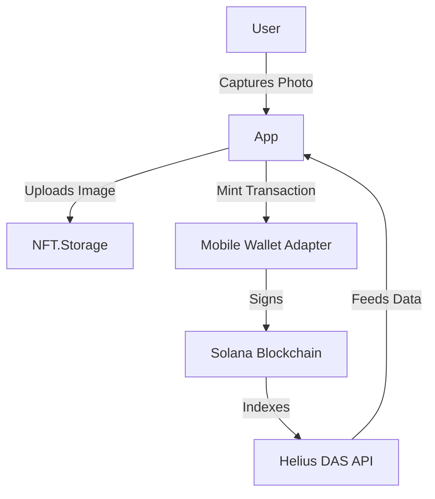

# SolFlux ⚡

**Proof-of-Moment Social Platform on Solana Mobile**

SolFlux is a mobile-native social app built for the **Solana Mobile MONOLITH Hackathon**. It allows users to capture real-world moments, mint them as compressed NFTs (cNFTs) with GPS and timestamp metadata, and share them in a token-gated social feed.


## 🚀 Key Features

- **📸 Proof-of-Moment**: Capture photos with embedded GPS & timestamp metadata.
- **⚡ Instant Minting**: Mint moments as **Compressed NFTs (cNFTs)** using Metaplex Bubblegum (sub-cent cost).
- **💸 SKR Economy**: 
  - **Burn-to-Mint**: Costs 1 SKR to mint a moment (deflationary).
  - **Tip-to-Support**: Users can tip creators in SKR directly from the feed.
- **📱 Mobile Native**: 
  - Built with **React Native (Expo SDK 54)**.
  - **Mobile Wallet Adapter (MWA)** for secure transaction signing.
  - **AMOLED Dark Mode** optimized for mobile displays.
- **📍 Location-Based**: Feed displays location context for every moment.

## 🛠️ Tech Stack

- **Frontend**: React Native, Expo, TypeScript
- **Blockchain**: Solana Web3.js, Metaplex Bubblegum, SPL Token
- **Data Integrations**: 
  - **Helius DAS API**: High-performance asset indexing and feed retrieval.
  - **IPFS (NFT.Storage)**: Decentralized image and metadata storage.
- **Wallet**: Solana Mobile Wallet Adapter (compatible with Phantom, Solflare, etc.).

## 📦 Installation & Setup

### Prerequisites
- **Node.js** (v18+)
- **Expo Go** app on your Android Phone
- **Android Device** (Solana Mobile Saga/Seeker recommended, or any Android phone)

### 1. Clone & Install
```bash
git clone https://github.com/HyperionBurn/SolFlux.git
cd SolFlux
npm install
```

### 2. Configure Environment
Create a `.env` file (or update `src/config/constants.ts`):
```env
HELIUS_API_KEY=your_key_here
NFT_STORAGE_API_KEY=your_key_here
```

### 3. Run the App

#### Option A: Expo Go (Quick UI Test)
Ideal for testing UI (Feed, Profile, Navigation). **Note: Wallet connection & Minting will NOT work** in Expo Go due to native module requirements.
```bash
npx expo start --go --clear
```
Scan the QR code with Expo Go.

#### Option B: Development Build (Full Features)
Required for **Wallet Connection**, **Camera**, and **Minting**.
```bash
# Build the APK
npx eas build --profile development --platform android

# Install on your device and run:
npx expo start --dev-client
```

## 🏗️ Architecture



## 📜 License
MIT License. Built for the Solana Mobile Hackathon 2026.
